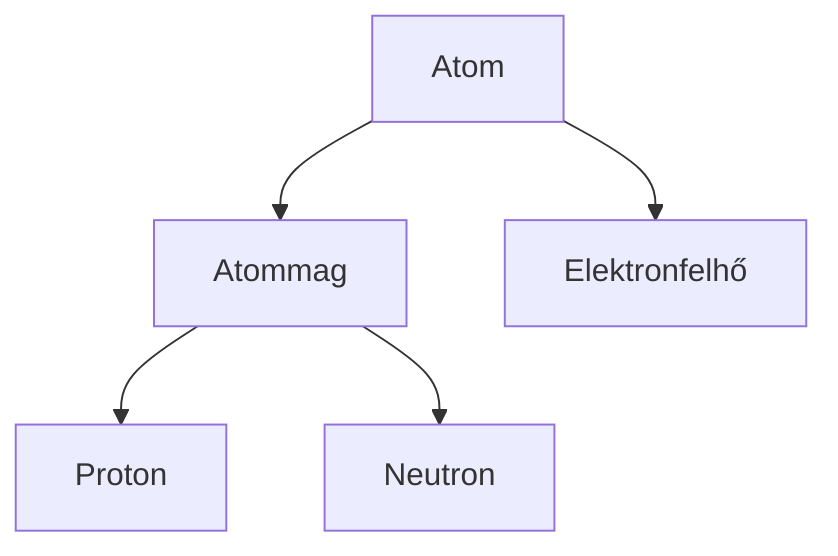
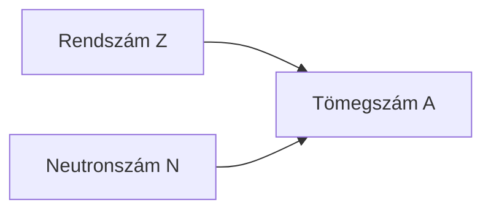
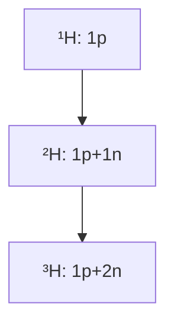
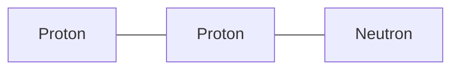
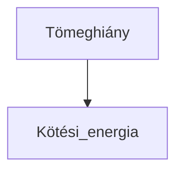
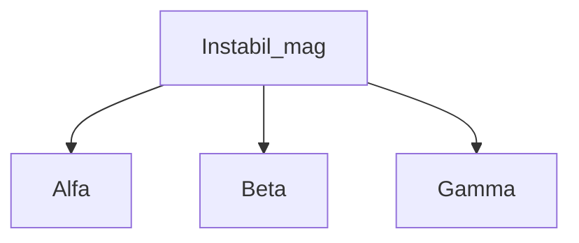
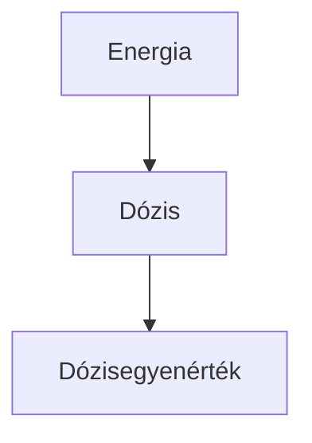
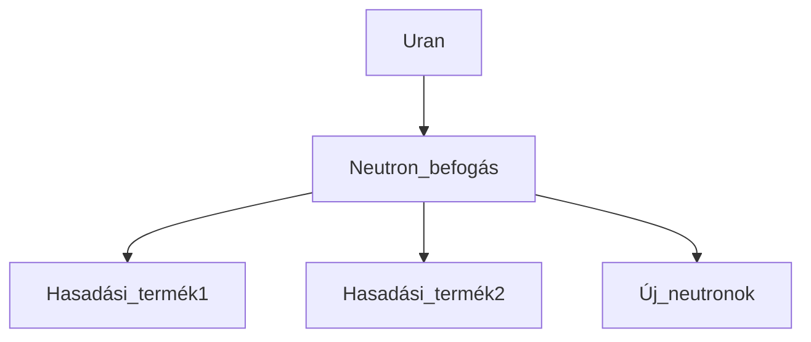
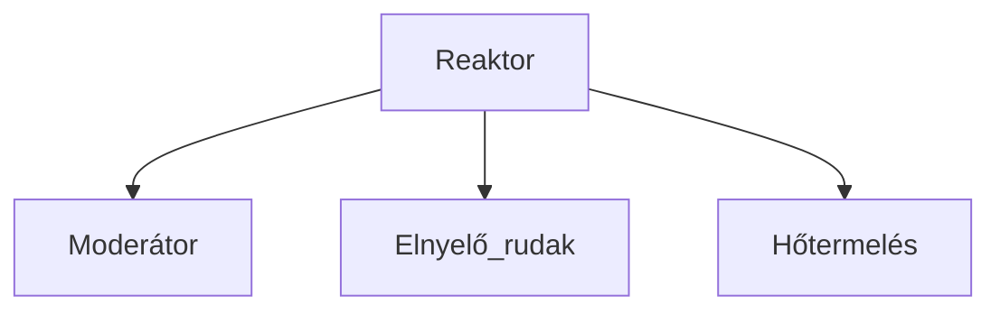

# Atommag és radioaktivitás jegyzet

## 1. Az atommag felépítése
Az atommagot **nukleonok** alkotják: protonok és neutronok. Az atom tömegének körülbelül **99,9%-a** az atommagban található.

**Méretek:**
- Atommag mérete: ≈ 10⁻¹⁵ m  
- Atom mérete: ≈ 10⁻¹⁰ m  

**Részecskék nyugalmi tömege:**
- Proton (mₚ) = 1,672 × 10⁻²⁷ kg  
- Neutron (mₙ) = 1,674 × 10⁻²⁷ kg  
- Elektron (mₑ) = 9,109 × 10⁻³¹ kg  

## 2. Magfizikai alapfogalmak

- **Rendszám (Z):** protonok száma  
- **Neutronszám (N):** neutronok száma  
- **Tömegszám (A):** protonok + neutronok száma  
- Összefüggés: A = Z + N

### Izotópok
Azonos rendszámú, de eltérő tömegszámú atomok. Kémiailag hasonlóak, magfizikailag eltérőek.  

**Példa – hidrogén izotópjai:**
- Prócium (¹H): 1 proton  
- Deutérium (²H): 1 proton + 1 neutron  
- Trícium (³H): 1 proton + 2 neutron  

## 3. Erős kölcsönhatás, tömeghiány és kötési energia

### Erős kölcsönhatás
- Rövid hatótávolságú  
- Rendkívül erős  
- Töltéstől független (p⁺–p⁺, n⁰–n⁰, p⁺–n⁰)  

### Tömeghiány (Δm)
A mag tömege kisebb, mint az alkotó nukleonok tömegének összege.

### Kötési energia
E = Δm · c² (c ≈ 3 × 10⁸ m/s)  
Az egy nukleonra jutó kötési energia a mag stabilitása szempontjából fontos.

## 4. Radioaktivitás
Instabil atommagok sugárzás kibocsátásával alakulnak át stabilabb állapotba.

**Sugárzástípusok:**
- Alfa (α): hélium-mag, töltés +2, alacsony áthatolóképesség  
- Béta (β⁻): elektron, töltés −1, közepes áthatolóképesség  
- Gamma (γ): elektromágneses sugárzás, töltés 0, nagy áthatolóképesség  

**Bomlástípusok:**
- Alfa-bomlás: A − 4, Z − 2  
- Béta-bomlás: neutron → proton + elektron, Z + 1  
- Gamma-sugárzás: gerjesztett állapot megszűnésekor  

## 5. Bomlástörvény és felezési idő
**Felezési idő (T):** az az idő, amely alatt a radioaktív atomok fele elbomlik.  
**Bomlástörvény:** N(t) = N₀ × (1/2)^(t / T)  
**Aktivitás:** az időegység alatt bekövetkező bomlások száma, mértékegysége Becquerel (Bq)  

## 6. Sugárvédelem és dozimetria
- **Elnyelt dózis:** D = E / m (Gray)  
- **Dózisegyenérték:** H = Q × D (Sievert), ahol Q a sugárzás minőségi tényezője  

## 7. Maghasadás (fisszió)
Nehéz magok (pl. ²³⁵U) neutron befogása után két közepes magra hasadnak.

- Energia: ~32 pJ / atommag  
- 1 mol urán hasadása ≈ 20 millió MJ  

## 8. Láncreakció és sokszorozási tényező (k)
- k < 1 → szubkritikus (reakció leáll)  
- k = 1 → kritikus (atomerőmű)  
- k > 1 → szuperkritikus (atombomba)  

## 9. Reaktorok és alkalmazások
**Moderátorok:** víz, grafit  
**Neutronelnyelők:** kadmium, bór  

**Alkalmazások:**
- Radiokarbon kormeghatározás (¹⁴C, T = 5730 év)  
- Tríciumos kormeghatározás (T = 12,5 év)  
- Orvosi diagnosztika és sugárterápia (jód-131)  
- Energiatermelés (Paksi Atomerőmű)  

